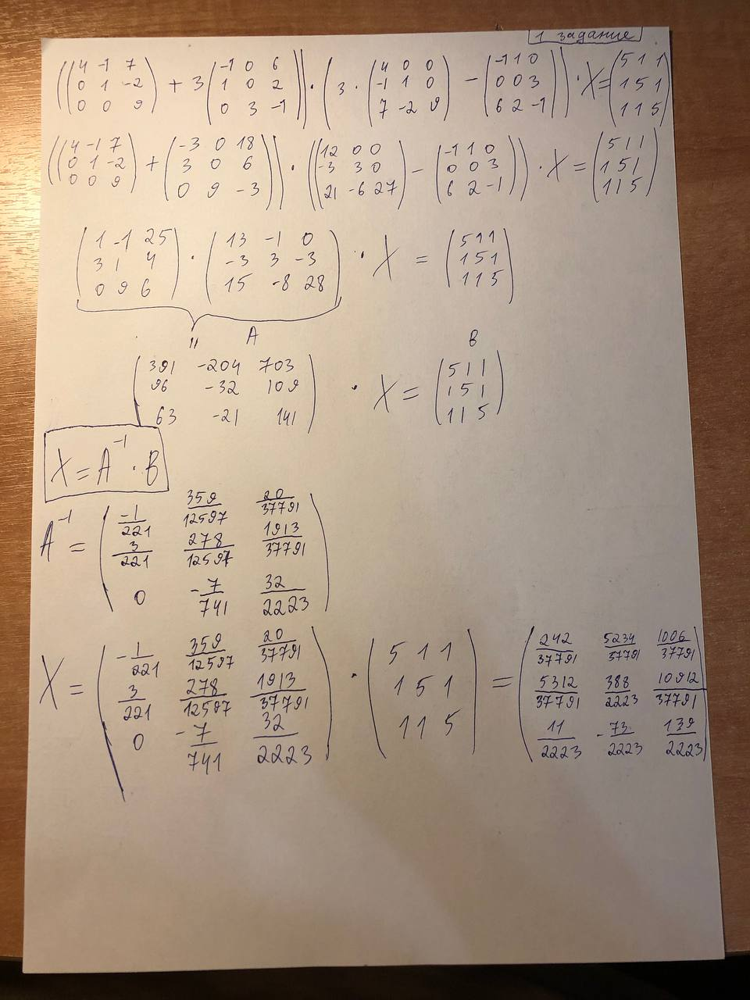

<h2 style="text-align: center;">Бюджетное учреждение высшего образования Ханты-Мансийского автономного округа – Югры</h2>

<h1 style="text-align: center;">«СУРГУТСКИЙ ГОСУДАРСТВЕННЫЙ УНИВЕРСИТЕТ»</h1>

<h2 style="text-align: center;">Политехнический институт</h2>

<p style="text-align: center;">Кафедра прикладной математики</p>

<p style="text-align: center;">Гркикян Мисак Эдикович</p>

<h1 style="text-align: center;">Индивидуальное задание №1</h1>

<p style="text-align: center;">Дисциплина «Алгебра и геометрия»</p>

<p style="text-align: center;">направление 01.03.02 «Прикладная математика и информатика»</p>

<p style="text-align: center;">направленность (профиль): «Технологии программирования и анализ данных»</p>

<pre>

</pre>

<p style="text-align: right;">Преподаватель: Шапошникова Ирина Вадимовна  </p>

<p style="text-align: right;">Доцент</p>

<p style="text-align: right;">Студент гр. № 601-31</p>

<p style="text-align: right;">Гркикян Мисак Эдикович</p>

<pre>

</pre>

<p style="text-align: center;">Сургут 2024 г.</p>


#### Задание 1 

#### Программное решение 

```python
import numpy as np

# Заданные матрицы
A = np.array([[4, -1, 7], [0, 1, -2], [0, 0, 9]])
B = np.array([[-1, 1, 0], [0, 0, 3], [6, 2, -1]])
C = np.array([[5, 1, 1], [1, 5, 1], [1, 1, 5]])

# Вычисление B^T и A^T
B_T = np.transpose(B)
A_T = np.transpose(A)

# Вычисление (A+3B^T) и (3A^T-B)
term1 = np.add(A, 3*B_T)
term2 = 3*A_T - B

# Вычисление (A+3B^T)(3A^T-B)
product = np.dot(term1, term2)

# Решение уравнения (A+3B^T)(3A^T-B)X = C
X = np.linalg.solve(product, C)

# Проверка решения с использованием подстановки
equation = np.dot(np.dot((A+3*B_T), (3*A_T-B)), X)
print(np.allclose(equation, C))  # True, если все элементы достаточно близки 
print("\nРезультаты:")
print(X)
```
#### Результат 1


#### Аналитическое решение 



#### Задание 2

#### Программное решение 

```python
import numpy as np

# Заданные матрицы
A = np.array([[-1, 2, -4], [1, -1, 7], [-1, 0, 0]])
B = np.array([[1, 0, 0], [0, 2, 0], [1, 0, 3]])
C = np.array([[3, 8, -1], [0, 8, 0], [2, -1, 3]])

# Вычисление (A^2 * B + B^3 * A)^T
term1 = np.dot(np.dot(A, A), B)
term2 = np.dot(np.dot(B, B), np.dot(B, A))
result = np.transpose(term1 + term2)

# Решение уравнения (A^2 * B + B^3 * A)^T * X = B * C
X = np.linalg.solve(result, np.dot(B, C))

print(X)

# Проверка решения с использованием подстановки
equation = np.dot(np.transpose(term1 + term2), X)
print(np.allclose(equation, np.dot(B, C)))  # True, если все элементы достаточно близки 
print("\nРезультаты:")
print(X)
```

#### Результат 2


#### Аналитическое решение 


#### Задание 3

#### Программное решение 

```python
import numpy as np

A = np.array([[2, -1, -1], [0, 2, -1], [0, 0, -1]])
B = np.array([[-1, 0, 0], [1, -3, 0], [1, 1, -5]])

# Вычисляем A^3, A^2 и A
A_cubed = np.linalg.matrix_power(A, 3)
A_squared = np.linalg.matrix_power(A, 2)

# Вычисляем выражение (A^3 - 2A^2 + 3A)
expression = A_cubed - 2 * A_squared + 3 * A

# Вычисляем транспонированное выражение
expression_transpose = expression.T

# Вычисляем 4B^2 - B
B_squared = np.linalg.matrix_power(B, 2)
result = 4 * B_squared - B

# Решаем уравнение (A^3 - 2A^2 + 3A)^T * X = 4B^2 - B
X = np.linalg.solve(expression_transpose, result)

print(X)
```

#### Результат 3


#### Аналитическое решение 

