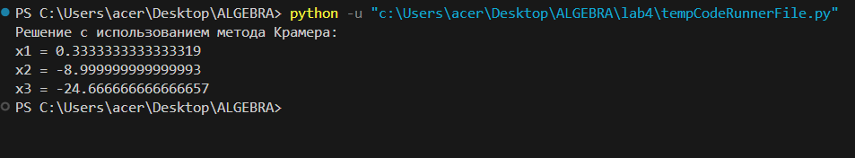

<h2 style="text-align: center;">Бюджетное учреждение высшего образования Ханты-Мансийского автономного округа – Югры</h2>

<h1 style="text-align: center;">«СУРГУТСКИЙ ГОСУДАРСТВЕННЫЙ УНИВЕРСИТЕТ»</h1>

<h2 style="text-align: center;">Политехнический институт</h2>

<p style="text-align: center;">Кафедра прикладной математики</p>

<p style="text-align: center;">Гркикян Мисак Эдикович</p>

<h1 style="text-align: center;">Индивидуальное задание №2</h1>

<p style="text-align: center;">Дисциплина «Алгебра и геометрия»</p>

<p style="text-align: center;">направление 01.03.02 «Прикладная математика и информатика»</p>

<p style="text-align: center;">направленность (профиль): «Технологии программирования и анализ данных»</p>

<pre>

</pre>

<p style="text-align: right;">Преподаватель: Шапошникова Ирина Вадимовна  </p>

<p style="text-align: right;">Доцент</p>

<p style="text-align: right;">Студент гр. № 601-31</p>

<p style="text-align: right;">Гркикян Мисак Эдикович</p>

<pre>

</pre>

<p style="text-align: center;">Сургут 2024 г.</p>

#### Задание 1 

#### Программное решение 

```python
import numpy as np

# Создаем матрицу коэффициентов
A = np.array([[1, 2, -1],
              [2, -3, 1],
              [1, 1, -1]])

# Создаем вектор правой части уравнений
B = np.array([7, 3, 16])

# Используем функцию solve для решения системы
X = np.linalg.solve(A, B)

# Выводим решение
print("Решение с использованием функции solve:")
print("x1 =", X[0])
print("x2 =", X[1])
print("x3 =", X[2])
```

```python
import numpy as np

# Создаем матрицу коэффициентов
A = np.array([[1, 2, -1],
              [2, -3, 1],
              [1, 1, -1]])

# Создаем вектор правой части уравнений
B = np.array([7, 3, 16])

# Инициализируем решения
X = np.zeros(3)

# Вычисляем определитель матрицы коэффициентов
detA = np.linalg.det(A)

# Вычисляем определитель для каждой неизвестной
for i in range(3):
    # Заменяем i-ый столбец матрицы коэффициентов на вектор правых частей
    A[:, i] = B

    # Вычисляем определитель новой матрицы
    detAi = np.linalg.det(A)

    # Вычисляем i-ую неизвестную
    X[i] = detAi / detA

    # Возвращаем исходную матрицу коэффициентов
    A = np.array([[1, 2, -1],
                  [2, -3, 1],
                  [1, 1, -1]])

# Выводим решение
print("Решение с использованием метода Крамера:")
print("x1 =", X[0])
print("x2 =", X[1])
print("x3 =", X[2])
```

#### Результат 1

1. 
2. 

#### Задание 2 

#### Программное решение 

```python
import numpy as np

# Создаем матрицу коэффициентов
A = np.array([[1, 1, 1, 1, 1],
              [0, 2, 1, 1, 1],
              [0, 0, 3, 1, 1],
              [0, 0, 0, 4, 1],
              [0, 0, 0, 0, 5]])

# Создаем вектор правой части уравнений
B = np.array([5, 4, 3, 2, 1])

# Используем функцию solve для решения системы
X = np.linalg.solve(A, B)

# Выводим решение
print("Решение с использованием функции solve:")
for i in range(len(X)):
    print("x" + str(i+1) + " =", X[i])
```

```python
import numpy as np

# Создаем матрицу коэффициентов
A = np.array([[1, 1, 1, 1, 1],
              [0, 2, 1, 1, 1],
              [0, 0, 3, 1, 1],
              [0, 0, 0, 4, 1],
              [0, 0, 0, 0, 5]])

# Создаем вектор правой части уравнений
B = np.array([5, 4, 3, 2, 1])

# Решаем систему методом обратного хода метода Гаусса
X = np.linalg.inv(A).dot(B)

# Выводим решение
print("Решение с использованием метода обратного хода метода Гаусса:")
for i in range(len(X)):
    print("x" + str(i+1) + " =", X[i])
```

#### Результат 2

1. 
2. 

#### Задание 3 

#### Программное решение 

```python
import numpy as np

# Создаем матрицу коэффициентов
A = np.array([[1, 1, 1, 1, 5],
              [1, 1, 1, 5, 0],
              [1, 1, 5, 0, 0],
              [1, 5, 0, 0, 0],
              [5, 0, 0, 0, 0]])

# Создаем вектор правой части уравнений
B = np.array([1, 1, 1, 1, 1])

# Используем функцию solve для решения системы
X = np.linalg.solve(A, B)

# Выводим решение
print("Решение с использованием функции solve:")
for i in range(len(X)):
    print("x" + str(i+1) + " =", X[i])
```

```python
import numpy as np

# Создаем матрицу коэффициентов
A = np.array([[1, 1, 1, 1, 5],
              [1, 1, 1, 5, 0],
              [1, 1, 5, 0, 0],
              [1, 5, 0, 0, 0],
              [5, 0, 0, 0, 0]])

# Создаем вектор правой части уравнений
B = np.array([1, 1, 1, 1, 1])

# Метод последовательного исключения переменных
x1 = B[4] / A[4, 0]  # Из последнего уравнения
x2 = (B[3] - A[3, 0] * x1) / A[3, 1]  # Из предпоследнего уравнения
x3 = (B[2] - A[2, 0] * x1 - A[2, 1] * x2) / A[2, 2]  # И т.д.
x4 = (B[1] - A[1, 0] * x1 - A[1, 1] * x2 - A[1, 2] * x3) / A[1, 3]
x5 = (B[0] - A[0, 0] * x1 - A[0, 1] * x2 - A[0, 2] * x3 - A[0, 3] * x4) / A[0, 4]

solution2 = np.array([x1, x2, x3, x4, x5])

print('решение:')
for i in range(len(solution2)):
    print("x" + str(i+1) + " =", solution2[i])
```

#### Результат 3
1. 
2. 
